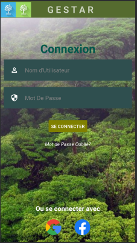
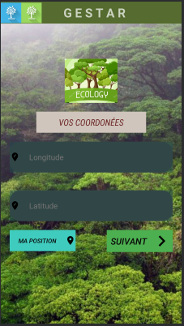

# Application Mobile d'Enregistrement des Arbres forestiers V_1.5/2.0
<p align="center">
 </div>
</p>

GESTARBRE est une application mobile qui offre la possibilité aux agents forestiers d'enregistrer les nouveaux arbres plantés ou découverts.
Ils pourront notamment enregistrer les coordonnées géographiques des arbres de manière automatique (longitude, latitude) et leur description générale. 

<p align="center">
 </div>
</p>

## TECHNOLOGIES UTILISEES

* Core Java
* SDK version 30
* MySQL

# Guide de déploiement
Pour plus d'informations contactez Tamaroas Dev sur facebook ou envoyez moi un Mail (<b>martialkom123@gmail.com</b>)

## Géolocalisation automatique

* Donner les permissions d'accès à la position et à internet
```xml

    <uses-permission
        android:name="android.permission.ACCESS_COARSE_LOCATION"
        android:maxSdkVersion="22" />
    <uses-permission android:name="android.permission.INTERNET" />
    <uses-permission android:name="android.permission.ACCESS_FINE_LOCATION" />
 ```

* Vérification des permissions à l'ouverture de l'application (src/main/java/cm/pfe/gestarbre/MainActivity.java)
```java
    private boolean checkLocationPermission() {
        int location = ContextCompat.checkSelfPermission(this, Manifest.permission.ACCESS_FINE_LOCATION);
        int location2 = ContextCompat.checkSelfPermission(this,Manifest.permission.ACCESS_COARSE_LOCATION);

        List<String> listPermission = new ArrayList<>();

        if(location != PackageManager.PERMISSION_GRANTED){
            listPermission.add(Manifest.permission.ACCESS_FINE_LOCATION);
        }

        if(location2 != PackageManager.PERMISSION_GRANTED){
            listPermission.add(Manifest.permission.ACCESS_COARSE_LOCATION);
        }
        if(!listPermission.isEmpty()){
            ActivityCompat.requestPermissions(this,listPermission.toArray(new String[listPermission.size()]),
                    1);

        }

        return true;
    }
 ```

 